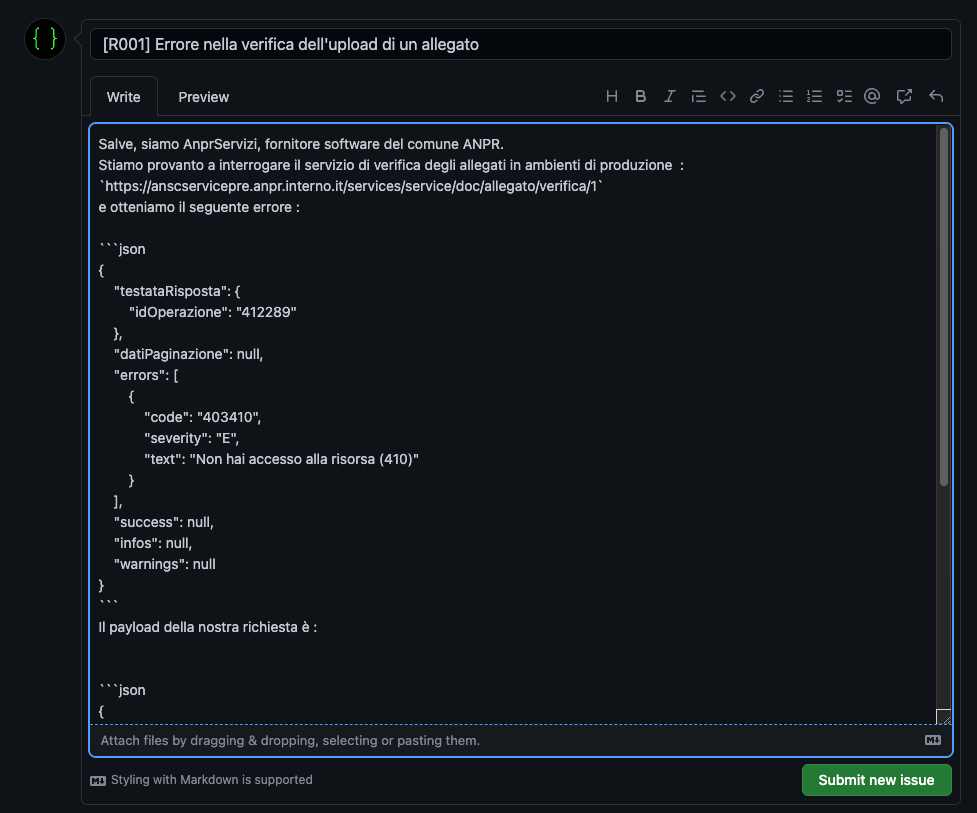

# 	Archivio Nazionale informatizzato dei registri dello Stato Civile (ANSC)

## 1. Il progetto ANSC

Il progetto ANSC - Archivio nazionale informatizzato dei registri dello stato civile, si inserisce nell’ambito più ampio del programma di estensione dei servizi digitali offerti  dall’ ANPR - Anagrafe nazionale della popolazione residente, così come previsto dall’art. 62 c. 2 bis del D.Lgs 82/2005  (CAD - Codice dell’amministrazione digitale). 

Con apposito decreto del Ministero dell’Interno ([D.M. del 18/10/2022](http://www.gazzettaufficiale.it/eli/id/2022/11/17/22A06473/sg)), sono state definite le modalità e i tempi di adesione da parte dei comuni all' ANSC, con conseguente dismissione della versione cartacea dei registri di stato civile.

Inoltre, una delle misure dell’asse “*Digitalizzazione della pubblica amministrazione”* del Piano Nazionale di Ripresa e Resilienza (PNRR) riguarda “l’*attuazione della semplificazione e della digitalizzazione di 50 procedure critiche che interessano direttamente i cittadini”*, nell'ambito delle quali è compresa l'informatizzazione dei registri dello stato civile.

Con l'istituzione dell’ ANSC ogni comune potrà accedere a una piattaforma unica centralizzata, gestita dal Ministero dell’Interno, per le attività di registrazione, archiviazione e conservazione, che consentirà altresì il rilascio dei certificati stato civile. 

## 2. Il canale GitHub

Il canale ha un duplice scopo:

- **archiviazione**: pubblicazione ufficiale della documentazione tecnica finalizzata allo sviluppo e test dei servizi cooperativi di integrazione dei gestionali locali con il sistema centrale ANSC;
- **supporto**: canale di comunicazione ufficiale del progetto ANSC, finalizzato al supporto ai comuni e ai loro fornitori software per le segnalazioni relative alla documentazione tecnica nel processo di sviluppo e test dei servizi cooperativi. 

## 3. Archiviazione

Nella cartella [docs](docs/index.md) si trova la seguente documentazione tecnica :

- Il contratto di servizio, in formato [OpenAPI](docs/openapi/index.md) e [PDF](docs/Caratteristiche_servizi/index.md).
- Il mapping [dei metadati necessari](docs/Mapping_casi_uso) per casi d'uso in formato xlsx e csv.
- La [storia delle versioni e patch](docs/Changelog.md) rilasciate.
- La [note di rilascio](docs/ReleaseNotes.md), contenenti eventuali dettagli aggiuntivi necessari per un rilascio.
- [Il piano di test](docs/CasiTest/index.md).

## 4. Supporto

Creare una segnalazione in Github è molto semplice e può essere fatta direttamente dal proprio account. Se non si possiede un account, si può creare registrandosi al seguente link, utilizzando alternativamente la propria mail personale o aziendale (link:<https://github.com/join?source=login>).

Una volta registrati, è possibile aggiungere una nuova *issue* entrando nella sezione “*issues*” e cliccando sul pulsante verde sulla destra “*new issue*”, come rappresentato nel template sottostante. 

Prima di creare una nuova *issue*, si suggerisce sempre di controllare che la stessa segnalazione non sia già presente tra le *issue* pubblicate.

**Importante!**  

Si chiede di non inserire dati sensibili dei cittadini, evitando qualsiasi nome, cognome, o codice fiscale. Non ci sono problemi invece nell'inserire dei codici di richiesta o identificativi di scheda.

Inoltre, si chiede di non inserire nessun dato relativo a configurazioni di sicurezza, quali certificati o password.

Si ricorda di inserire sempre:

- una descrizione accurata del comportamento o dell'errore, specificando che tipo di supporto si richiede;
- la data del test, l'ambiente usato (pre-produzione o produzione), codici di richiesta o identificativi da usare per verificare il sistema;
- nome, cognome e comune di riferimento dell’operatore.

## 5. Il processo di change mgmt

ANSC gestisce il rilascio di nuovi versioni del sistema tramite un processo di [change management](ChangeManagement.md) che coinvolge tutti gli stakeholder progettuali. 
